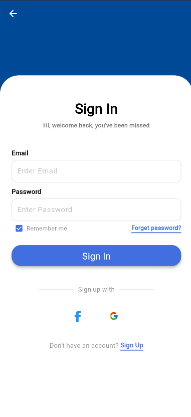
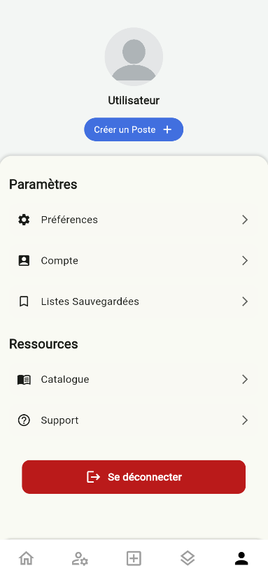
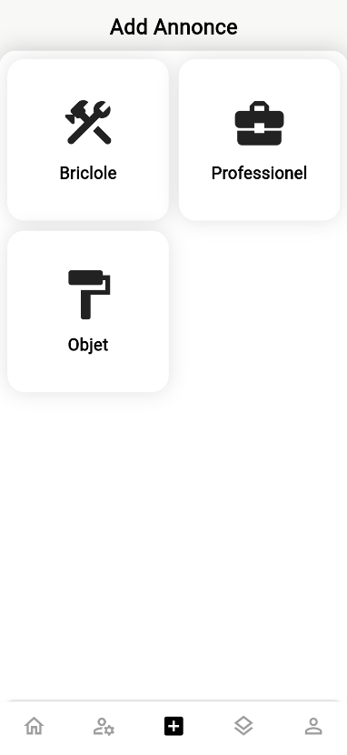
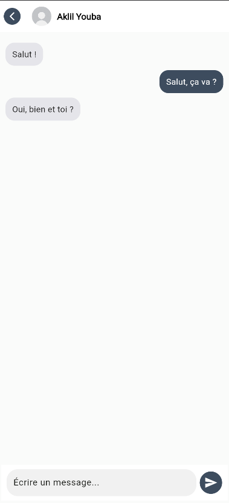
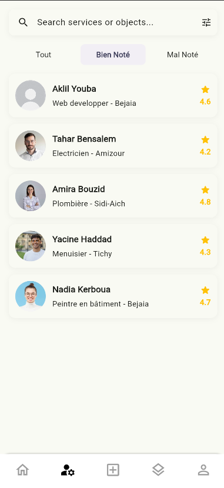
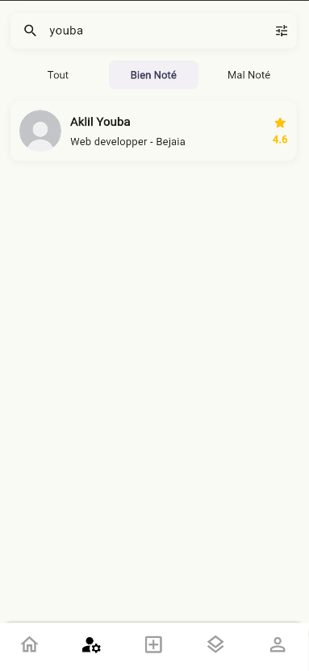
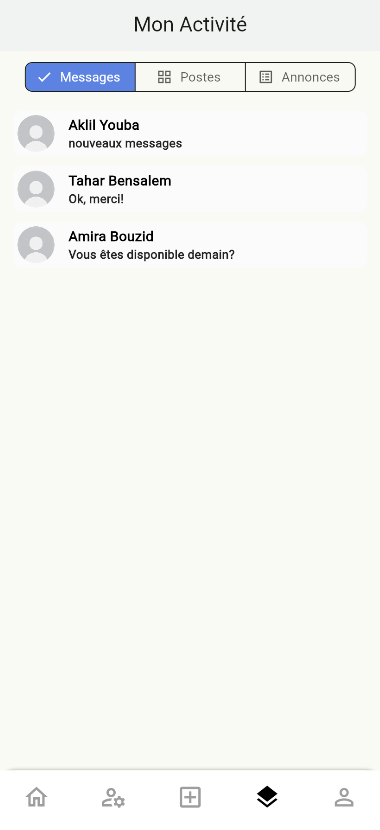
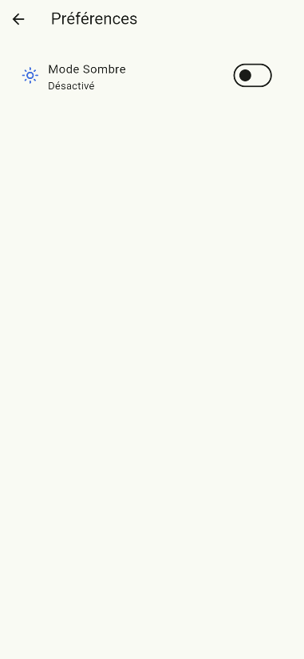

# BricoRasy 🔧

> **"Les jeunes pour régler l'image"**  
> A mobile platform connecting individuals with skilled workers and artisans for DIY, maintenance, and professional services.

---

## 📱 Overview

**BricoRasy** is a Flutter-based mobile application developed as a final year project at **Université Abderrahmane Mira Béjaïa** (2024/2025). It serves as a marketplace between:

- 👷 **Artisans / Workers** — who offer their skills and find job opportunities
- 🏠 **Employers** — who post tasks and hire help
- 🔩 **Tool Renters** — who list or borrow equipment

Inspired by platforms like TaskRabbit, Fiverr, and BricoRAM — but built for the **Algerian local market**.

---

## ✨ Features

| Feature | Description |
|---|---|
| 🔐 Authentication | Sign in / Sign up with email or social login |
| 📢 Post Announcements | Publish Bricole, Professional, or Object rental listings |
| 🔍 Search & Discover | Filter artisans by specialty, location, and rating |
| 💬 Real-time Messaging | Integrated chat powered by Socket.IO |
| ⭐ Rating System | Mutual reviews between employers and artisans |
| 🛠️ Tool Rental | Browse and reserve equipment with pricing |
| 👤 Profile Management | Distinct profiles for clients and artisans |
| 🌙 Dark / Light Mode | User preference theming |

---

## 📸 Screenshots

<table>
  <tr>
    <td align="center"><b>Sign In</b></td>
    <td align="center"><b>Profile</b></td>
    <td align="center"><b>Add Annonce</b></td>
    <td align="center"><b>Messaging</b></td>
  </tr>
  <tr>
    <td></td>
    <td></td>
    <td></td>
    <td></td>
  </tr>
  <tr>
    <td align="center"><b>Artisan List</b></td>
    <td align="center"><b>Search</b></td>
    <td align="center"><b>Activity</b></td>
    <td align="center"><b>Preferences</b></td>
  </tr>
  <tr>
    <td></td>
    <td></td>
    <td></td>
    <td></td>
  </tr>
</table>

---

## 🏗️ Architecture

```
BricoRasy/
├── lib/
│   ├── main.dart
│   ├── models/          # Data models (Artisan, Post, Conversation...)
│   ├── screens/         # All UI screens
│   │   ├── sign_page/   # Auth flow
│   │   ├── home/        # Home, Search, Bricole
│   │   ├── artisan/     # Artisan profiles & comments
│   │   ├── add_anno/    # Announcement creation
│   │   ├── profil_page/ # User profile & catalog
│   │   └── personnel_page/ # Activity & chat
│   ├── services/        # API & socket services
│   ├── widgets/         # Reusable UI components
│   └── theme/           # Light/dark theme
├── assets/
│   ├── images/
│   └── json/
└── .env                 # API base URL & config
```

---

## 🛠️ Tech Stack

**Frontend**
- [Flutter](https://flutter.dev) — Cross-platform mobile UI framework
- Provider — State management
- Socket.IO Client — Real-time messaging
- `http`, `image_picker`, `share_plus`, `url_launcher`

**Backend** *(separate repo)*
- [Node.js](https://nodejs.org) + [Express.js](https://expressjs.com)
- [MongoDB](https://www.mongodb.com) + Mongoose ODM
- JWT Authentication
- Socket.IO — WebSocket server

**Infrastructure**
- [Render](https://render.com) — Backend hosting
- [MongoDB Atlas](https://www.mongodb.com/atlas) — Cloud database
- [Google Cloud Storage](https://cloud.google.com/storage) — Media files

---

## 🚀 Getting Started

### Prerequisites

- Flutter SDK `^3.7.2`
- Dart SDK `^3.7.2`
- Node.js `>=18`
- MongoDB (local or Atlas)

### Installation

```bash
# Clone the repo
git clone https://github.com/FivefromSky/BricoRasyFix.git
cd BricoRasyFix

# Install Flutter dependencies
flutter pub get

# Configure environment
cp .env.example .env
# Edit .env and set your API base URL
```

### Environment Variables

Create a `.env` file at the root:

```env
BASE_URL=http://your-backend-url:3000
```

### Run

```bash
flutter run
```

---

## 👥 Team

| Name | Role |
|---|---|
| AISSANI Anis | Flutter / Backend |
| AMARI Rahim | Socket / UI |
| AFKIR Azeddine | Conception / Report |
| ALILI Sidali | Flutter / Backend |
| AKLIL Youba | Flutter / UI |

**Supervised by:** Mme. K. Ait Abdelouhab  
**Institution:** Université Abderrahmane Mira Béjaïa — Faculté des Sciences Exactes  
**Degree:** Licence en Systèmes Informatiques — 2024/2025

---

## 📄 License

This project was developed as an academic final year project. All rights reserved © 2025 BricoRasy Team.